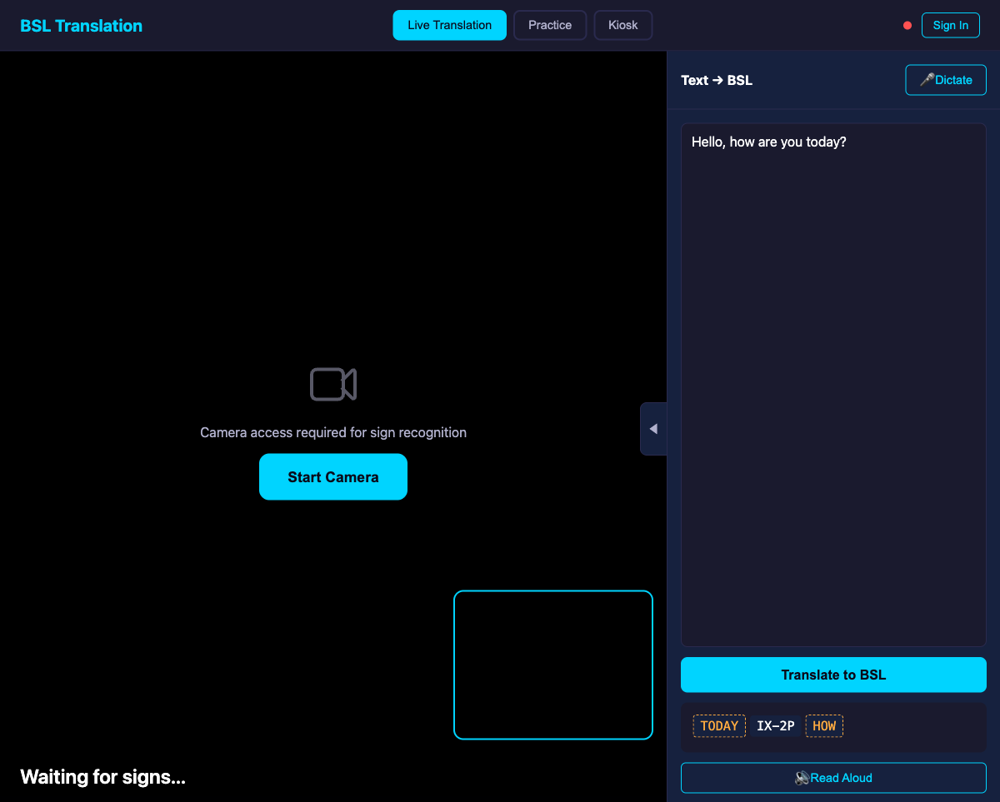
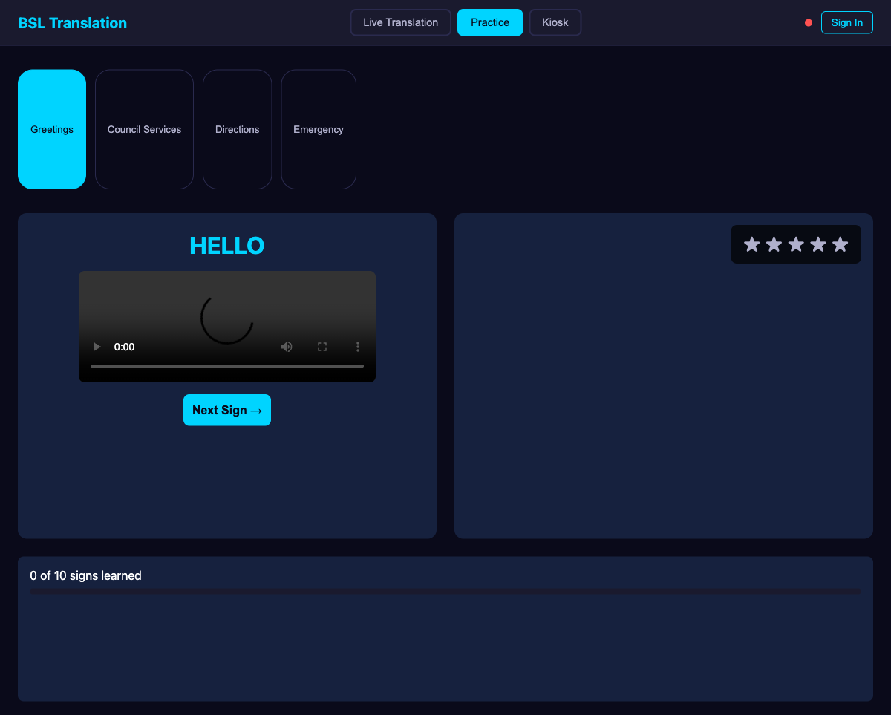
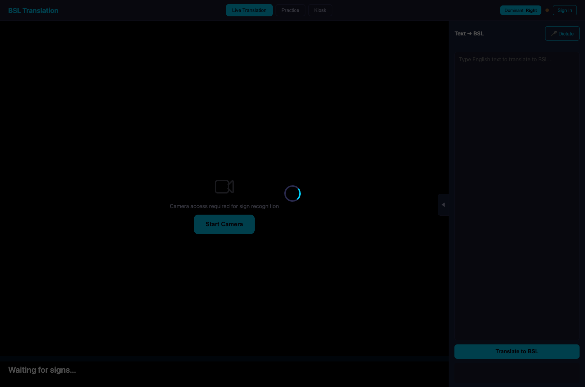
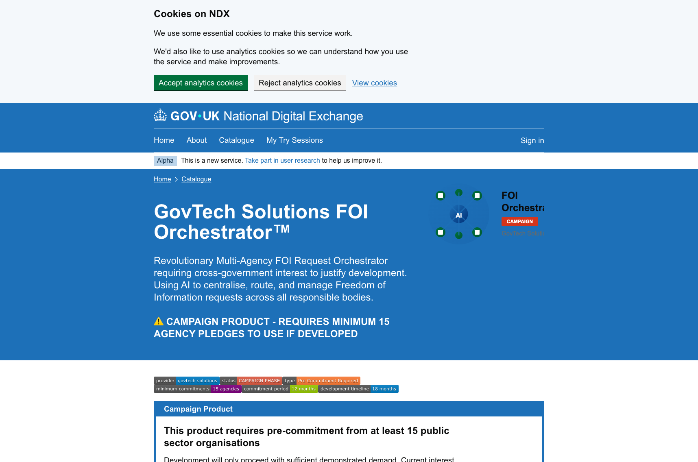
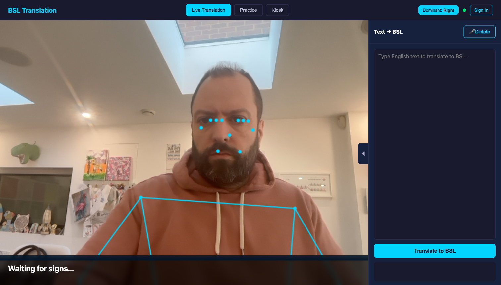

# Teaching a computer to understand British Sign Language -- an experiment with NDX:Try

What happens when you give a curious person access to cloud computing and AI tools, point them at an interesting problem, and say "see what you can do"? That is essentially what [NDX:Try](https://aws.try.ndx.digital.cabinet-office.gov.uk) is designed for -- and this is a story about one such experiment. It ran for four days, produced 19 model versions, consumed 60+ hours of compute, and ended with something that sort of works. The journey is more interesting than the destination.

## The idea

Around 87,000 people in the UK use British Sign Language (BSL) as their first or preferred language. For many of them, interacting with public services -- councils, government departments, the NHS -- means navigating systems built entirely around English. There are interpreters and relay services, but they are not always available, and they are expensive. What if a browser -- just a normal web page -- could recognise sign language in real time?

That was the question. Not "can we build a production service" -- that is a much bigger ask with years of work behind it. The question was simpler: *is this even feasible?* Could a local government officer, or a team in a digital unit, explore this idea without needing to procure GPU servers, negotiate data agreements, or stand up ML infrastructure from scratch?

## What NDX:Try gives you

NDX:Try is a free platform that provides UK public sector organisations with temporary AWS environments for experimentation. You get a sandbox account -- an isolated, time-limited AWS environment with guardrails -- and you can use it to try things out. Pre-built scenarios cover common use cases like chatbots and dashboards, but the sandbox itself is open. You can spin up virtual machines, use AI services, store data, and run experiments.

The key thing is that it is *safe*. The sandbox accounts are isolated from production systems. They auto-clean when your session expires. There is no risk of accidentally exposing real data or racking up unexpected bills. It is designed for exactly this kind of thing: "I have an idea, I want to see if it works."

## Starting small -- the hand-crafted approach

The first version of the BSL recogniser was deliberately simple. MediaPipe -- Google's open-source pose estimation library -- runs entirely in the browser. Point your webcam at someone signing, and MediaPipe gives you coordinates for 33 body landmarks, 468 facial landmarks, and 42 hand landmarks, all in real time. No server needed.

The challenge is turning those landmark coordinates into a recognised sign. BSL signs are defined by six phonological parameters: where your hands are (location), how they move (movement), what shape they make (handshape), which way the palm faces (orientation), whether one or both hands are used, and whether the hand touches the body (contact). We built scoring functions for each of these and defined 270 signs by hand.

It sort of worked. On a good day, with clear signing, in good light, it could recognise some signs. But "sort of worked" is not good enough to answer the question of whether this approach is feasible.

## The prototype

Even at this early stage, we built out a full interface to see what the experience might feel like. The whole thing was generated from a technical specification using the BMAD quick-dev methodology -- describing the desired outcome and letting Claude Code, Anthropic's AI coding assistant, build the implementation. At 08:46 on Monday morning, the spec described a bidirectional BSL system: SageMaker GPU inference, Bedrock Claude for text-to-BSL translation, Lambda functions, and a three-mode frontend. By mid-morning, it existed.

The prototype has three modes:


*The main interface: camera feed on the left for sign recognition, text-to-BSL translation panel on the right. Three modes -- Live Translation, Practice, and Kiosk -- let you explore different interaction patterns.*

The text-to-BSL direction uses Amazon Bedrock's Claude to translate English sentences into BSL gloss notation -- the written representation of sign language that captures its distinct grammar. "Hello, welcome to the council office" becomes the gloss sequence HELLO, WELCOME, COUNCIL, OFFICE.


*English to BSL translation. The AI translates natural English into BSL gloss notation, which follows BSL grammar rather than English word order. "Hello, how are you today?" becomes TODAY IX-2P HOW -- BSL puts time references first.*


*BSL has its own grammar. The sentence "Hello, how are you today?" translates to the gloss sequence TODAY, IX-2P (a pronoun pointing sign), HOW -- demonstrating how BSL front-loads time references.*

Practice mode lets you learn signs with reference videos, categorised by context -- Greetings, Council Services, Directions, Emergency -- with a star rating for how well the recogniser matched your attempt.


*Practice mode: pick a category, watch the reference video, try the sign yourself, and get rated. A gamified way to explore whether recognition actually works in practice.*

## The deployment disaster tour

Generating code from a spec is the easy part. Getting it to actually run in a sandbox environment is where the educational content begins.

The first deployment attempt was at 09:27. The CloudFormation template exceeded the 51KB inline limit. Easy enough -- upload it to S3 and reference it. Then the seed Lambda function exceeded the ZipFile size limit for inline code. Then SAM's Tags format did not match CloudFormation's Tags format. Then orphaned CloudWatch Log Groups from a previous failed deployment blocked the next attempt. Then Lambda Function URLs -- needed for the backend API -- were blocked by the Innovation Sandbox's Service Control Policy.

Each failure took between ten and thirty minutes to diagnose and fix. By 10:40, the stack was deployed. The whole process was an exercise in learning what the sandbox environment allows and what it does not, which is arguably the most valuable thing you learn from actually using it.

By 11:37, the frontend was running but the recogniser was not recognising anything. Just "waiting for signs." The practice session videos would not play. This is the part where things got properly embarrassing.

## The wrong model -- WLASL versus BSL

At 11:40, we discovered the first model was trained on WLASL -- the Word-Level American Sign Language dataset. Not British Sign Language. American. The AI assistant, when tasked with building a sign language recogniser, had reached for the most readily available dataset it could find, and that happened to be American.

It gets worse. The model loading code included `model.load_state_dict(state_dict, strict=False)`. That `strict=False` flag is the kind of thing that looks innocuous until you understand what it does: it silently drops any parameters that do not match. In this case, it had dropped all 344 parameters. The model was running on random weights. It had approximately 0% real accuracy.

The feedback was direct: "doesn't appear to be actually trained with anything sane, you should not have used WLASL at all, this is not acceptable, this is british, only BSL and maybe Makaton."

Fair.

By 13:23, we had switched to BSL-1K, a dataset from Oxford's Visual Geometry Group containing 1,064 BSL signs. This involved fixing DataParallel key remapping issues and pinning numpy to version 1.x to avoid compatibility problems. The model loaded properly this time. But the results were still poor: "the model is not working well, signing even 'hello' is not recognised."

At 17:54 came a useful observation: "it needs to be based on movement not just still things." Signs are not static poses -- they are movements through space. A static snapshot of hand positions is not enough. At 19:01: "30fps is great, but it needs to be taking segments." The recogniser needed to look at sequences of frames, not individual frames.

That evening was spent on a series of increasingly desperate attempts to make the hand-crafted scoring approach work. Version 9 scored 6 out of 119 signs correctly (5.0%). Version 10 tried continuous scoring and made things worse. Version 11 tried a power transform -- also worse. Dynamic Time Warping template matching produced marginal improvements. The ceiling was low and we were hitting it repeatedly.

## The hand-crafted ceiling -- 5% accuracy

The fundamental problem with hand-crafted scoring is that it requires you to define, precisely and mathematically, what each sign looks like. "Is the dominant hand above the non-dominant hand? Is the palm facing inward? Is there lateral movement?" These binary questions throw away enormous amounts of information. Real signing is fluid, continuous, and highly variable between signers. Reducing it to a decision tree is like trying to recognise spoken words by checking whether the speaker's mouth is open or closed.

Five percent accuracy on 119 signs is barely above random chance. It was obvious that hand-crafted rules were not going to get us where we needed to be.

## The ML pivot

At 06:51 on day two came the message that changed the direction of the experiment: "plan a ML based classification development journey then."

This was the decisive moment. Stop trying to encode human knowledge of what signs look like. Instead, show the computer thousands of examples and let it learn. The sandbox had the compute. The academic world had the data. The AI assistant could write the training pipeline.

By 14:52, we were deep into data sourcing research. The ideal dataset would be BOBSL -- the BBC-Oxford British Sign Language dataset, containing 1,400 hours of interpreted BBC content with 2,281 sign classes. But at 16:20, the door closed: BOBSL access is restricted to academic research institutions under BBC Terms of Use. Independent researchers, students, and commercial organisations are explicitly excluded. A government sandbox experiment does not qualify.

So we worked with what was openly available.

## The multi-signer breakthrough

The first ML model (v14) was trained on synthetic data -- one reference video per sign, with computer-generated variations in position and scale. It scored 14 out of 119 signs correctly: 11.8% accuracy. Better than hand-crafted, but still terrible.

Then we trained on BSLDict -- an academic dataset from Oxford's Visual Geometry Group containing over 14,000 video clips of BSL signs performed by 124 different signers. Even with just 4-5 videos per sign from different people, accuracy jumped to 103 out of 119: 86.6%.

That was the breakthrough. The thing that makes sign recognition hard is not the algorithmic complexity -- it is the variance. Different people sign differently. Their hands are different sizes. They move at different speeds. They hold signs for different durations. A model trained on one person's signing cannot recognise another person's signing. A model trained on many people's signing can recognise almost anyone's signing.

Real human variance, it turns out, is something you cannot synthesise.

## Scaling up -- EC2, seven data sources, and four days of compute

With the approach validated on 119 signs, the obvious question was: how far can we push this? BSL has thousands of signs in everyday use. Could we scale from 119 to hundreds, or thousands?

At 07:43 on day three: "this is still rubbish" -- the browser demo with 119 signs was not impressive enough. At 07:50: "abandon running locally and boot a big vm to download quickly and run there." The cloud pivot.

We spun up a c5.4xlarge EC2 instance -- 16 vCPU cores, 32GB of RAM -- and started downloading data from every BSL-related source we could find. This produced its own set of problems. Cloudflare's bot protection blocked video downloads from EC2 IP addresses, requiring user-agent rotation and rate limiting. The SSH parent process was killed by the bootstrap script's use of `pkill`. Academic video servers had inconsistent availability and aggressive rate limits.

Data came from seven sources:

| Source | Videos | Notes |
|--------|--------|-------|
| BSLDict (Oxford VGG) | 13,090 | The core BSL dataset |
| BSL SignBank (UCL) | 3,586 | Additional BSL reference videos |
| Auslan Signbank | 8,561 | Australian Sign Language -- same BANZSL family as BSL |
| NZSL | 4,805 | New Zealand Sign Language -- also BANZSL family |
| Dicta-Sign | 1,019 | EU research project |
| SSC STEM | 2,682 | Scottish Sensory Centre STEM vocabulary |
| Christian-BSL | 580 | Domain-specific BSL |
| BKS | 2,072 | Additional BSL data |

Auslan and NZSL are part of the same BANZSL language family as BSL, sharing roughly 82% of their vocabulary. Including them was a bet that the shared hand movements would help generalisation, even where the specific signs differ.

The v18 mega-training run started with 306,174 samples across 14,948 sign classes. CPU utilisation climbed from 579% to 672% across the 16 cores. The SSH daemon became unreachable as the operating system had nothing left to give it. RAM usage grew from 6GB to 9.5GB.

At 02:24 on March 13, after nearly 24 hours of continuous training, fold 1 came back: 89.6% top-1 accuracy, 98.6% top-5, across 14,948 signs.


*Version 18: from 119 signs to 14,948. The homepage now shows category browsers for the full vocabulary.*


*The v18 model recognising signs in real time. The confidence scores show the top predictions for each detected sign segment.*

## The messy reality of experiments

Blog posts about ML projects tend to present a clean narrative: we had an idea, we tried it, it worked. The reality was considerably messier, and that is worth talking about because it is the reality of experimentation.

### The sandbox ran out

NDX:Try sandbox sessions are time-limited -- that is a feature, not a bug, because it keeps costs controlled and prevents abandoned infrastructure from accumulating. But our training run took nearly four days of continuous compute.

The panic was real. "Download any intermediary data so that we can resume if our sandbox acc expires." The response was sobering: "sandbox expire will also delete s3 data, the whole aws acc will go away." Twenty-four gigabytes of processed training data, extracted features, and partially trained models -- all of it would vanish.

We downloaded everything. The 24GB backup took hours over the SSH connection that kept dropping. But it worked. The data survived. The experiment continued.

This is actually a useful finding for the platform: some experiments need longer-running compute than a standard session allows. The sandbox handled this gracefully -- we did not lose data, just time -- but it highlighted that ML training workloads have different lifecycle patterns from typical evaluation tasks.

### SSH starvation

When you run a CPU-intensive training job at 675% utilisation on a 16-core instance, the operating system has very little headroom left for anything else. The SSH daemon -- the way we connected to check progress -- became intermittently unreachable. Sometimes it would take 10-15 attempts to get a connection. Other times we would connect, check the training log, and get disconnected mid-command.

We worked around this by writing training logs to a file and uploading checkpoints to S3, so we could monitor progress even when SSH was unreliable. But it was a reminder that running long compute jobs on shared-purpose instances requires some operational awareness. The periodic question "is it still actually progressing?" became a refrain.

### The GPU quest

When we tried to speed up the final training phase by launching a GPU instance (g4dn.xlarge with an NVIDIA Tesla T4), we hit a GPU vCPU quota of zero. This is not a sandbox restriction -- it is standard behaviour for new AWS accounts. GPU instances need an explicit quota increase request, which goes through AWS support.

The first request was denied. "Sandbox accounts often can't get GPU quotas." A second attempt, requesting "EC2 Instances / All G and VT Spot Instance Requests", was approved within a couple of hours. But that is time eaten out of a sandbox session that is already ticking down.

It is the kind of thing you only learn by trying. And once you know, you know -- request your GPU quota early, before you need it.

### Data: finding it, downloading it, licensing it

The feature extraction pipeline involved downloading videos from half a dozen academic sources, each with different formats, connection reliability, and rate limits. The Auslan Signbank download hit connection resets periodically and slowed to a crawl. The SSC STEM extraction died at 57% completion. We built retry logic, checkpointing, and parallel extraction to handle this -- but it was a reminder that ML data pipelines are inherently brittle.

The bigger issue is licensing. For a research experiment like this, downloading publicly available sign language videos and training a model is reasonable. But the licensing landscape for BSL data is a patchwork:

| Source | License | Notes |
|--------|---------|-------|
| BSLDict (Oxford VGG) | Unclear -- "check license before use" | Videos sourced from signbsl.com contributors |
| BSL SignBank (UCL) | No explicit content license | Software is BSD-3-Clause, content terms unstated |
| Auslan Signbank | CC BY-NC-ND 4.0 | Non-commercial, no derivatives |
| Dicta-Sign | EU project -- terms unclear | Contact University of Hamburg |
| SSC STEM | University of Edinburgh IP | Explicit permission required |
| Christian-BSL | Not stated | Publicly available videos |
| NZSL | CC BY 4.0 (via BANZ-FS) | Permissive |

For an experiment running in a sandbox, this is fine -- we are not distributing or commercialising anything. But it highlights a real challenge for anyone wanting to take sign language recognition further. The best BSL datasets either have unclear licensing or are locked behind academic access requirements.

The most notable example is **BOBSL** -- the BBC-Oxford British Sign Language dataset. It contains 1,400 hours of interpreted BBC content with 2,281 sign classes and would be transformative training data. But access is restricted to academic research institutions under BBC Terms of Use. Independent researchers, students, and commercial organisations are explicitly excluded. For a public sector innovation experiment, that door is closed.

This is a pattern across sign language AI research more broadly. The data exists, the techniques are proven, but the path from experiment to product runs through licensing negotiations that can take months. It is an area where more openly-licensed BSL data would make a significant difference.

## The 1am impatience

The v19 training run was on a GPU instance -- a g4dn.xlarge with an NVIDIA Tesla T4. What had taken 60+ hours on CPU was projected to take around 2.5 hours on GPU. The GPU sat at 100% utilisation, using 14GB of its 15GB VRAM.

At 01:15: "now?"

At 01:23: "now?"

At 01:28: "now?"

There is something both absurd and perfectly human about checking on a machine learning training run at one in the morning, every eight minutes, like a child asking "are we there yet?" from the back seat. The experiment had started as a professional curiosity. By day four, it had become a compulsion.

At 10:10 the next morning: "sorry machine crashed, check in, hows it going?" The local machine had crashed overnight. The training, running on EC2, was fine. By 10:47, all data was downloaded locally. "Everything is off AWS. Safe to terminate."

## The training architecture

```
+-----------------------------------------------------------------+
|                    Training Pipeline (EC2)                       |
|                                                                  |
|  +----------+   +----------+   +---------+   +------------+     |
|  | Video    |-->| MediaPipe|-->| Feature |-->|   Train    |     |
|  | Sources  |   | Holistic |   | Extract |   |  PyTorch   |     |
|  | (27,000+)|   | Landmarks|   | 142-dim |   |    MLP     |     |
|  +----------+   +----------+   +---------+   +-----+------+     |
|                                                     |            |
|  Sources:                                           v            |
|  - BSLDict (Oxford, 13,090 videos)         +--------------+     |
|  - BSL SignBank (UCL, 3,586)               | ONNX Export  |     |
|  - Auslan (8,561)                          |  (27MB)      |     |
|  - NZSL (4,805)                            +------+-------+     |
|  - Dicta-Sign (1,019)                            |              |
|  - SSC STEM (2,682)                              |              |
|  - Christian-BSL (580)                           |              |
|  - BKS (2,072)                                   |              |
+-------------------------------------------------+|--------------+
                                                   |
                          +------------------------+
                          v
+-----------------------------------------------+
|              Browser (no server needed)        |
|                                                |
|  +--------+   +----------+   +-------------+  |
|  | Webcam |-->| MediaPipe|-->| ONNX Runtime|  |
|  |        |   | (browser)|   |  Web (27MB) |  |
|  +--------+   +----------+   +------+------+  |
|                                      |         |
|                                      v         |
|                               +------------+   |
|                               | Recognised |   |
|                               |   Sign     |   |
|                               +------------+   |
+------------------------------------------------+
```

The pipeline ran across multiple data sources: BSLDict from Oxford, BSL SignBank from UCL, Dicta-Sign from an EU research project, Christian-BSL videos, New Zealand Sign Language and Auslan -- both part of the same BANZSL language family as BSL, sharing roughly 82% of their vocabulary.

We ended up processing over 27,000 videos. The EC2 instance ran for nearly four days straight, extracting landmarks and training the model. At peak, it was using 675% CPU across its 16 cores -- all of them maxed out, with the SSH daemon so starved for resources that we could only connect intermittently to check progress.

## Where we are now -- v19

The current model -- version 19 -- recognises 18,871 distinct signs. It was trained on a GPU instance using all seven data sources plus the expanded Auslan corpus.

Here is where honesty matters. Version 19 is actually *less accurate* than version 18 on the metrics that matter: 77.8% top-1 accuracy versus 89.6%, and 97.2% top-5 versus 98.6%. More signs, worse per-sign accuracy. This is the entirely predictable consequence of scaling a classifier to nearly 19,000 classes -- many of which are visually similar or share the same hand movements with subtle differences in location or orientation.

| Version | Signs | Top-1 Accuracy | Top-5 Accuracy | What changed |
|---------|-------|----------------|----------------|-------------|
| v9 | 119 | 5.0% | -- | Hand-crafted categorical scoring |
| v14 | 119 | 11.8% | -- | ML with synthetic data (1 video per sign) |
| v15 | 119 | 86.6% | -- | Real multi-signer data from BSLDict |
| v16 | 944 | 85.7% | -- | 8x vocabulary expansion, minimal accuracy loss |
| v18 | 14,948 | 89.6% | 98.6% | Mega-training, 7 sources, 60+ hours CPU |
| v19 | 18,871 | 77.8% | 97.2% | GPU training, expanded Auslan data |

The model still runs entirely in the browser using ONNX Runtime Web. No server calls needed for inference. It is a 27MB file that loads once and then classifies signs in milliseconds.


*Version 19: 18,871 signs. The accuracy dropped from v18, but the vocabulary expanded significantly. Whether that trade-off is worthwhile depends entirely on what you are trying to do.*

The whole thing -- the training data, the models, the extraction pipeline -- sat in an S3 bucket using about 30GB of storage. The trained model runs from a static web page with no ongoing infrastructure cost for inference.

### What the 30GB contained

```
S3 Bucket: bsl-training-305137865866 (30.1 GB)
+-- data/           19.4 GB  -- 37,069 training videos across all sources
|   +-- auslan/      5.6 GB  -- 8,561 Auslan Signbank videos
|   +-- bsl-signbank/         -- BSL SignBank (UCL)
|   +-- nzsl/                 -- New Zealand Sign Language
|   +-- dicta-sign/           -- EU research project
|   +-- christian-bsl/        -- domain-specific BSL
|   +-- bks/                  -- additional BSL data
+-- videos/          1.6 GB  -- 13,090 BSLDict videos (Oxford VGG)
+-- ssc-stem/        5.1 GB  -- 4,554 Scottish Sensory Centre STEM signs
+-- cache/           0.5 GB  -- extracted feature vectors (142-dim per video)
+-- output/          1.2 GB  -- trained ONNX models + metadata
|   +-- bsl_classifier_v17.onnx
|   +-- bsl_classifier_v18.onnx  (27MB, 14,948 classes)
|   +-- bsl_classifier_v19.onnx  (27MB, 18,871 classes)
|   +-- model_metadata_v19.json  (label map + scaler params)
+-- scripts/                  -- training pipeline code
```

## Nobody wrote any code

It is worth pausing on something that might not be obvious from the technical detail above: nobody sat down and wrote code for this project. Not the MediaPipe integration, not the PyTorch training pipeline, not the ONNX export, not the feature extraction scripts, not the browser-based classifier, not the download scrapers for seven different academic data sources, not the CloudFormation templates, not the Lambda functions, not the EC2 bootstrap scripts. Not even this blog post.

The entire project was built using Claude Code -- Anthropic's AI coding assistant -- driven by spec-based development using the BMAD methodology. We described outcomes: "we want to recognise BSL signs in a browser." The AI did the research -- surveying academic datasets, evaluating what was publicly available, mapping out the landscape of BSL corpora and their licensing terms. It produced documentation: a technical specification, architecture decisions, a data sources analysis. Then it wrote the code, iterated on it when things did not work, debugged the failures, and adapted its approach.

When the first model used the wrong sign language entirely, we said so. When the hand-crafted approach hit 5%, we said "plan a ML based classification development journey then." When the ML model scored 11.8%, we did not go back and hand-tune the code. We described the problem -- "this isn't working, the synthetic data doesn't generalise" -- and the AI researched alternatives, found BSLDict, wrote the download scripts, built the multi-signer training pipeline, and got us to 86.6%. When we wanted to scale to thousands of signs, it provisioned EC2 instances, wrote parallel extraction scripts, built the merge-and-train pipeline, and managed the four-day training run -- monitoring progress, handling SSH timeouts, restarting failed processes.

The human contribution was direction and judgement. Which ideas to pursue. When to pivot. Whether the accuracy was good enough. Whether the experiment was worth continuing. The AI handled the research, the implementation, the infrastructure, and the iteration.

This matters because it changes the profile of who can do this kind of work. You do not need to be a machine learning engineer. You do not need to know PyTorch, or MediaPipe, or how to configure EC2 instances, or how to export ONNX models. You need curiosity, a clear idea of what you are trying to achieve, and the judgement to evaluate whether it is working. The AI and the sandbox between them handle the rest.

That is a genuinely new capability for public sector innovation. The combination of free compute (the sandbox), free AI assistance (the coding agent), and open data (academic datasets) means that the limiting factor for experimentation is no longer technical skill or budget. It is imagination.

## What this does not prove

Let us be honest about how far this is from being useful.

**It is still rubbish for real BSL translation.** I am going to say that plainly because it is true. Recognising isolated signs from reference-style video is a long way from understanding BSL as a language. A person signing a sentence is not producing a sequence of dictionary entries. They are using space, facial expressions, body movement, timing, and context in ways that this model has no awareness of.

**The vocabulary still is not big enough.** BSL has somewhere between 20,000 and 100,000 key signs in active use, depending on how you count. Our 18,871 signs are in the right order of magnitude, but that is before you account for the fact that BSL -- like any living language -- has dialects, regional variations, and local idioms. The sign for "bread" in London is not necessarily the sign for "bread" in Glasgow. A model trained on academic reference videos from a handful of sources has no awareness of this variation.

**BSL is a language, not a vocabulary list.** Recognising individual signs is to understanding BSL what recognising individual words is to understanding spoken English -- necessary but nowhere near sufficient. BSL has its own grammar, which is fundamentally different from English. It uses space, facial expressions, body movement, and timing as grammatical structures. Two signs performed in different locations relative to the body can mean completely different things. A raised eyebrow is not decoration -- it is grammar. None of this is captured by a model that classifies isolated signs.

**This was built by someone who does not know BSL.** I started this experiment with only a superficial understanding of British Sign Language. The process of doing it taught me an enormous amount -- about BSL as a language, about its linguistic structure, about the deaf community's relationship with technology, about how much I did not know. But that is precisely the point: this was not built with domain expertise. It was built with curiosity. The result reflects that. A prototype built without deep BSL knowledge is a demonstration of what AI tools can do, not a demonstration of what BSL technology should look like.

**It has not been tested with deaf BSL users.** The test set uses reference videos, not real-world signing. User testing with the deaf community would be essential before drawing any conclusions about practical utility -- and that community's input should shape any future direction, not just validate a technical approach.

**The accuracy numbers come with caveats.** 77.8% accuracy across 18,871 signs sounds reasonable until you think about what it means in practice: roughly one in five signs misidentified. And the model was trained and tested on similar data distributions. Real-world performance, with real signers, in real environments, will be worse.

**More signs made it worse.** Version 19 is less accurate than version 18 despite having a larger training set. Scaling a classifier does not guarantee better results. At some point, you need better architectures -- transformers, attention mechanisms, temporal models that understand sign sequences rather than individual frames. This experiment did not get there.

## What this does prove

The experiment demonstrates something more fundamental than any particular accuracy number:

**A single person with a laptop and a sandbox can explore ideas that would previously have required a dedicated ML team.** The entire experiment -- from "I wonder if this is possible" to a working prototype with nearly 19,000 signs -- was done without writing a line of code manually. No ML engineers, no frontend developers, no DevOps team. Just a person with an idea, an AI assistant, and a sandbox.

**The barrier to experimentation has collapsed.** The compute for this project would have cost tens of thousands of pounds a decade ago. The academic datasets we used are openly available. The open-source tools are free. The sandbox environment is free. The AI writes the code. What is left is the idea and the willingness to try.

**Public sector innovation does not need to start with a business case.** This experiment might lead somewhere useful, or it might not. The point is that someone was able to try -- to ask "what if?" and actually explore the answer -- without procurement, without a project board, without a budget. That is what sandbox environments are for.

**Experiments are supposed to be messy.** We hit GPU quota limits, SSH timeouts, expired sandbox sessions, flaky data downloads, the wrong sign language entirely, training runs that took four days instead of four hours, and a model that got worse as we added more data. None of that meant the experiment failed -- it meant we were learning. Every one of those problems taught us something about running ML workloads in cloud environments, and that knowledge transfers to whatever comes next.

**The whole thing took four days.** From the first spec to a working prototype with 18,871 signs, including every wrong turn, every failed deployment, every restart. Four days, one person, no budget. That sentence would have been inconceivable five years ago.

## The repo is published

The entire codebase -- the frontend, the training pipeline, the data extraction scripts, the CloudFormation templates, the trained models, the documentation, and all 19 versions of increasingly questionable accuracy -- is published at [github.com/chrisns/bsl-experiment](https://github.com/chrisns/bsl-experiment). For posterity and as a warning to others.

If you are in UK public sector and you have an idea you would like to explore with AWS -- whether it is AI, data, infrastructure, or something else entirely -- [NDX:Try](https://aws.try.ndx.digital.cabinet-office.gov.uk) is there for exactly that. The worst that can happen is that your experiment does not work. And that is fine. That is what experiments are for.

---

*NDX:Try is available to UK public sector organisations at [aws.try.ndx.digital.cabinet-office.gov.uk](https://aws.try.ndx.digital.cabinet-office.gov.uk). The BSL sign language recognition experiment, including all training code and models, is open source at [github.com/chrisns/bsl-experiment](https://github.com/chrisns/bsl-experiment).*
